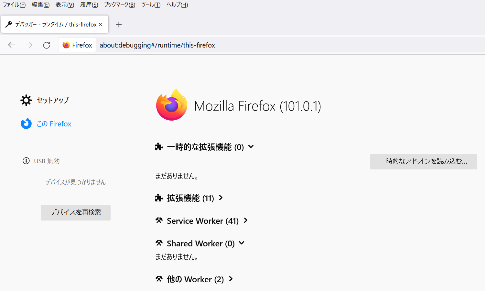
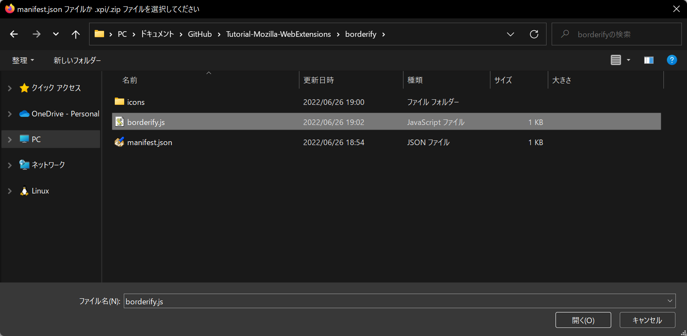
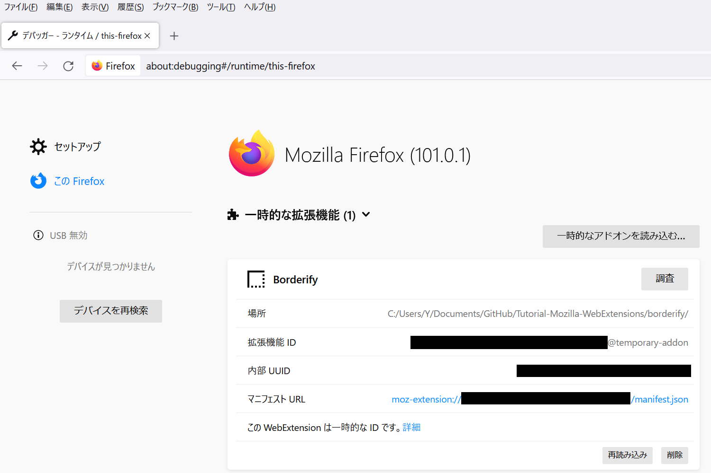

# Tutorial-Mozilla-WebExtensions

---

* [ブラウザー拡張機能](https://developer.mozilla.org/ja/docs/Mozilla/Add-ons/WebExtensions)
  * [mdn/webextensions-examples](https://github.com/mdn/webextensions-examples)

---

<br><br><br><br>

## borderify

```bash
mkdir borderify
cd borderify
```

<br><br><br>

### Download an icon file

```bash
mkdir icons
wget https://github.com/mdn/webextensions-examples/raw/master/borderify/icons/border-48.png -O icons/border-48.png
```

<br><br><br>

### manifest.json

```bash
nano manifest.json
```

```json
{
    "manifest_version": 2,
    "name": "Borderify",
    "version": "1.0",
    "description": "Adds a solid red border to all webpages matching mozilla.org.",
    "icons": {
        "48": "icons/border-48.png"
    },
    "content_scripts": [
        {
            "matches": [
                "*://*.mozilla.org/*"
            ],
            "js": [
                "borderify.js"
            ]
        }
    ]
}
```

<br><br><br>

### borderify.js

```bash
nano borderify.js
```

```js
document.body.style.border = "5px solid red";
```

<br><br><br>

### Load the extension

* [about:debugging](about:debugging)







---

<br><br><br><br>

## beastify

```bash
mkdir beastify
cd beastify
```

<br><br><br>

### Download an icon file

```bash
mkdir icons
wget https://raw.githubusercontent.com/mdn/webextensions-examples/master/beastify/icons/beasts-48.png -O icons/beasts-48.png
wget https://raw.githubusercontent.com/mdn/webextensions-examples/master/beastify/icons/beasts-32.png -O icons/beasts-32.png
```

```bash
mkdir beasts
wget https://raw.githubusercontent.com/mdn/webextensions-examples/master/beastify/beasts/frog.jpg -O beasts/frog.jpg
wget https://raw.githubusercontent.com/mdn/webextensions-examples/master/beastify/beasts/snake.jpg -O beasts/snake.jpg
wget https://raw.githubusercontent.com/mdn/webextensions-examples/master/beastify/beasts/turtle.jpg -O beasts/turtle.jpg
```

<br><br><br>

### manifest.json

```bash
nano manifest.json
```

```json
{
    "manifest_version": 2,
    "name": "Beastify",
    "version": "1.0",
    "description": "Adds a browser action icon to the toolbar. Click the button to choose a beast. The active tab's body content is then replaced with a picture of the chosen beast. See https://developer.mozilla.org/ja/Add-ons/WebExtensions/Examples#beastify",
    "homepage_url": "https://github.com/mdn/webextensions-examples/tree/master/beastify",
    "icons": {
        "48": "icons/beasts-48.png"
    },
    "permissions": [
        "activeTab"
    ],
    "browser_action": {
        "default_icon": "icons/beasts-32.png",
        "default_title": "Beastify",
        "default_popup": "popup/choose_beast.html"
    },
    "web_accessible_resources": [
        "beasts/frog.jpg",
        "beasts/turtle.jpg",
        "beasts/snake.jpg"
    ]
}
```

<br><br><br>

### popup

```bash
mkdir popup
cd popup
```

```bash
nano choose_beast.html
```

```html
<!DOCTYPE html>

<html>

<head>
    <meta charset="utf-8">
    <link rel="stylesheet" href="choose_beast.css" />
</head>

<body>
    <div id="popup-content">
        <div class="button beast">Frog</div>
        <div class="button beast">Turtle</div>
        <div class="button beast">Snake</div>
        <div class="button reset">Reset</div>
    </div>
    <div id="error-content" class="hidden">
        <p>Can't beastify this web page.</p>
        <p>Try a different page.</p>
    </div>
    <script src="choose_beast.js"></script>
</body>

</html>
```

```bash
nano choose_beast.css
```

```css
html, body {
    width: 100px;
}

.hidden {
    display: none;
}

.button {
    margin: 3% auto;
    padding: 4px;
    text-align: center;
    font-size: 1.5em;
    cursor: pointer;
}

.beast:hover {
    background-color: #CFF2F2;
}

.beast {
    background-color: #E5F2F2;
}

.reset {
    background-color: #FBFBC9;
}

.reset:hover {
    background-color: #EAEA9D;
}
```

```bash
nano choose_beast.js
```

```js

/**
 * ページのすべてを隠す CSS、ただし
 * "beastify-image" クラスを持つ要素は除く
 */
const hidePage = `body > :not(.beastify-image) {
                    display: none;
                  }`;

/**
 * ボタンクリックをリッスンし、ページ内のコンテンツスクリプトに
 * 適切なメッセージを送る
 */
function listenForClicks() {
    document.addEventListener("click", (e) => {

        /**
         * 動物の名前を受け取って、対応する画像の URL を取得する
         */
        function beastNameToURL(beastName) {
            switch (beastName) {
                case "Frog":
                    return browser.extension.getURL("beasts/frog.jpg");
                case "Snake":
                    return browser.extension.getURL("beasts/snake.jpg");
                case "Turtle":
                    return browser.extension.getURL("beasts/turtle.jpg");
            }
        }

        /**
         * アクティブなタブにページを隠す CSS を挿入して
         * 動物の URL を取得し、
         * アクティブなタブのコンテンツスクリプトに "beastify" メッセージを送る
         */
        function beastify(tabs) {
            browser.tabs.insertCSS({ code: hidePage }).then(() => {
                let url = beastNameToURL(e.target.textContent);
                browser.tabs.sendMessage(tabs[0].id, {
                    command: "beastify",
                    beastURL: url
                });
            });
        }

        /**
         * アクティブなタブからページを隠す CSS を削除し、
         * アクティブなタブのコンテンツスクリプトに "reset" メッセージを送る
         */
        function reset(tabs) {
            browser.tabs.removeCSS({ code: hidePage }).then(() => {
                browser.tabs.sendMessage(tabs[0].id, {
                    command: "reset",
                });
            });
        }

        /**
         * ただコンソールにエラーをログ出力する
         */
        function reportError(error) {
            console.error(`Could not beastify: ${error}`);
        }

        /**
         * アクティブなタブを取得し、
         * "beastify()" か "reset()" を適切に呼び出す
         */
        if (e.target.classList.contains("beast")) {
            browser.tabs.query({ active: true, currentWindow: true })
                .then(beastify)
                .catch(reportError);
        }
        else if (e.target.classList.contains("reset")) {
            browser.tabs.query({ active: true, currentWindow: true })
                .then(reset)
                .catch(reportError);
        }
    });
}

/**
 * スクリプトにエラーがあった。
 * ポップアップのエラーメッセージを表示し、通常の UI を隠す。
 */
function reportExecuteScriptError(error) {
    document.querySelector("#popup-content").classList.add("hidden");
    document.querySelector("#error-content").classList.remove("hidden");
    console.error(`Failed to execute beastify content script: ${error.message}`);
}

/**
 * ポップアップを読み込んだ時、コンテンツスクリプトをアクティブなタブに挿入し、
 * クリックハンドラーを追加する。
 * スクリプトの挿入ができない場合、エラー処理をする。
 */
browser.tabs.executeScript({ file: "/content_scripts/beastify.js" })
    .then(listenForClicks)
    .catch(reportExecuteScriptError);
```

```bash
cd ..
```

<br><br><br>

### コンテンツスクリプト

```bash
mkdir content_scripts
cd content_scripts
```

```bash
nano beastify.js
```

```js
(function () {
    /**
     * グローバルなガード変数をチェック、設定する。
     * コンテンツスクリプトが再び同じページに挿入された場合、
     * 次は何もしない。
     */
    if (window.hasRun) {
        return;
    }
    window.hasRun = true;

    /**
     * 動物の画像の URL を受け取り、既存の動物をすべて削除し、次に
     * 画像を指す IMG 要素の作成・スタイル適用を行い、
     * 作成したノードをドキュメント内に挿入する
     */
    function insertBeast(beastURL) {
        removeExistingBeasts();
        let beastImage = document.createElement("img");
        beastImage.setAttribute("src", beastURL);
        beastImage.style.height = "100vh";
        beastImage.className = "beastify-image";
        document.body.appendChild(beastImage);
    }

    /**
     * ページからすべての動物を削除する
     */
    function removeExistingBeasts() {
        let existingBeasts = document.querySelectorAll(".beastify-image");
        for (let beast of existingBeasts) {
            beast.remove();
        }
    }

    /**
     * バックグラウンドスクリプトからのメッセージをリッスンし、
     * "beastify()" か "reset()" を呼び出す。
     */
    browser.runtime.onMessage.addListener((message) => {
        if (message.command === "beastify") {
            insertBeast(message.beastURL);
        } else if (message.command === "reset") {
            removeExistingBeasts();
        }
    });

})();
```

<br><br><br>

### Load the extension

* [about:debugging](about:debugging)

---

Copyright (c) 2022 YA-androidapp(https://github.com/YA-androidapp) All rights reserved.
